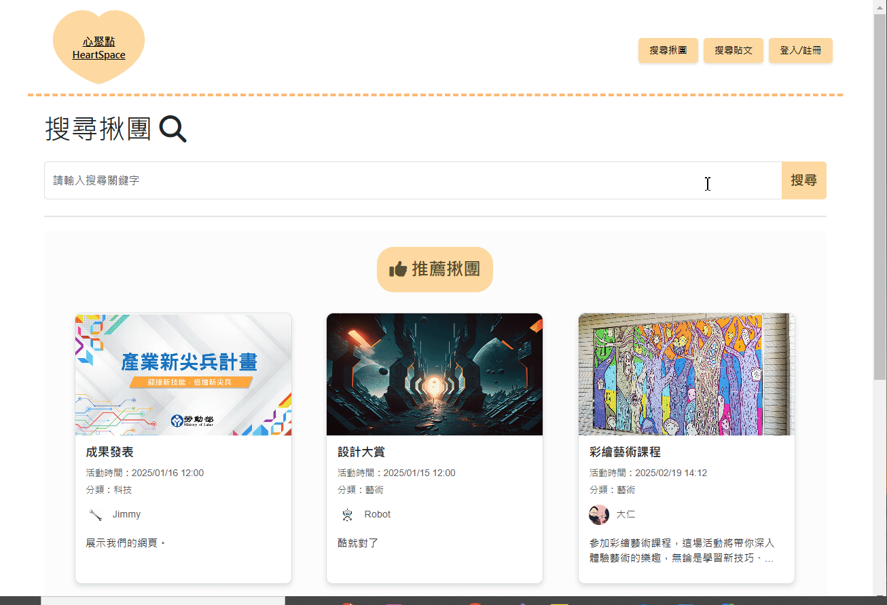
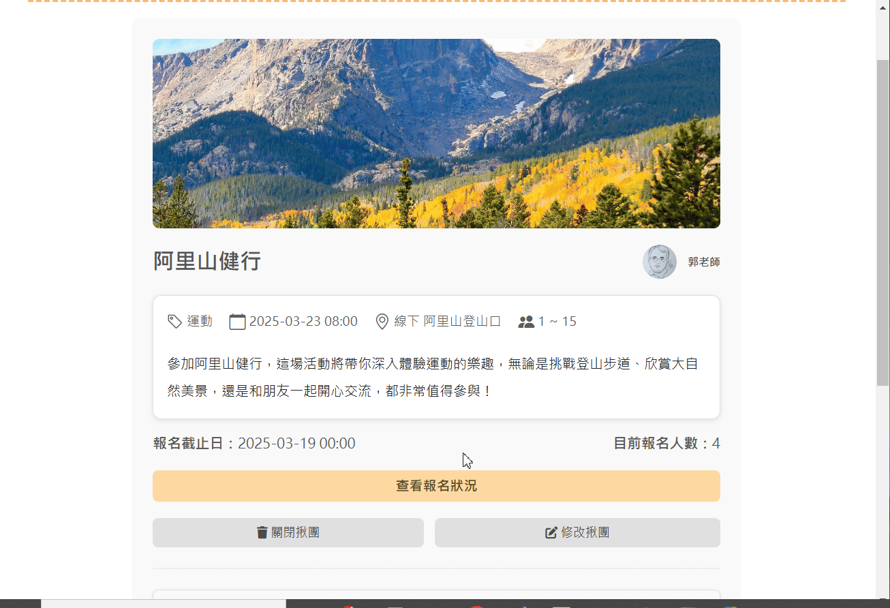
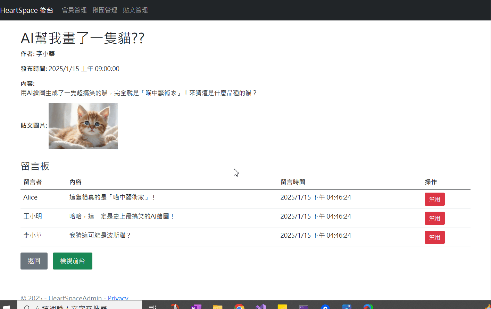

# 心聚點 HeartSpace

**社群服務網站**  
由 3 人團隊開發，使用 **ASP.NET MVC 5**、**ASP.NET Core MVC** 和 **MySQL**。  
網站提供使用者發布貼文、發起或報名活動，並支援關鍵字搜尋。  
另設有後台管理系統，供管理員管理使用者、貼文及活動。

---

## 🚀 **專案功能**

### 使用者功能：
- 發布、編輯、關閉**貼文**，並可於貼文下留言。
- 發起、編輯、關閉**活動**，並可報名活動及管理出席狀態。
- 支援關鍵字搜尋貼文與活動，快速找到所需內容。

### 管理員功能：
- 管理使用者帳號，包括啟用、停用及編輯帳號資訊。
- 管理所有貼文與活動，支援關閉貼文及留言。

---

## 🛠️ **技術細節**
- **後端技術**：ASP.NET MVC 5、ASP.NET Core MVC
- **前端技術**：HTML、CSS (Bootstrap 5)、jQuery、AJAX
- **資料庫**：MySQL
- **系統架構**：三層式架構、介面、依賴注入
- **ORM 工具**：Dapper、Entity Framework
- **版本控制**：Git

---


## 🖼️ **畫面截圖**

### 使用者介面：

- **搜尋功能**：用戶可透過發起人、標題或類別進行關鍵字搜尋，快速找到相關貼文或活動。  
   

- **活動**：用戶可發起活動，並進行內容編輯或刪除操作。  
   

- **出缺席管理**：活動發起人可管理參與者的出席狀態。  
   


### 後台管理系統：
- **用戶、活動及貼文管理**：管理者可編輯或停權用戶，並對活動、貼文及留言進行檢視或刪除操作，確保平台內容合規。  
  


---


## 📦 **專案安裝與執行**

1. **克隆專案**：
   ```bash
   git clone https://github.com/您的帳戶名/HeartSpace.git
   cd HeartSpace
2. **初始化資料庫**：
   - 將 `db/init-database.sql` 檔案匯入資料庫以建立資料表和預設資料。
   - 使用 MySQL Workbench 或其他資料庫工具執行 SQL 檔案。
3. **設定資料庫連線資訊**：  
   - 編輯專案中的 Web.config 或 appsettings.json 文件，填寫資料庫連線資訊
4. **啟動專案**：  
   - 使用 Visual Studio 開啟專案的 .sln 文件。  
   - 執行專案並啟動伺服器。  
5. **瀏覽網站**：  
   - 前台：http://localhost:44344
   - 後台：http://localhost:7075  
   - 圖庫：http://localhost:44378

---

### 未來精進方向

1. **功能擴展**
   - 提供一鍵分享功能，讓用戶可以將活動分享到 Facebook、Instagram、Twitter 等社交媒體，增加活動曝光度，吸引更多參與者。
   - 增加更高級的搜尋過濾條件，例如地理位置篩選或日期篩選功能。
   - 增加「熱門活動」和「最新活動」排行榜，按參與人數或瀏覽收藏次數進行排序，幫助用戶快速找到受歡迎的活動。
   - 支援活動的多媒體功能，例如圖片集或影片上傳。

2. **後台管理提升**
   - 引入數據可視化儀表板，幫助管理者快速了解用戶和活動數據。
   - 支援批量操作，例如批量停權用戶或刪除貼文。
   - 增強安全性措施，實現更細緻的權限管理。


